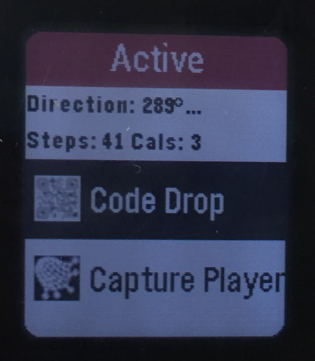
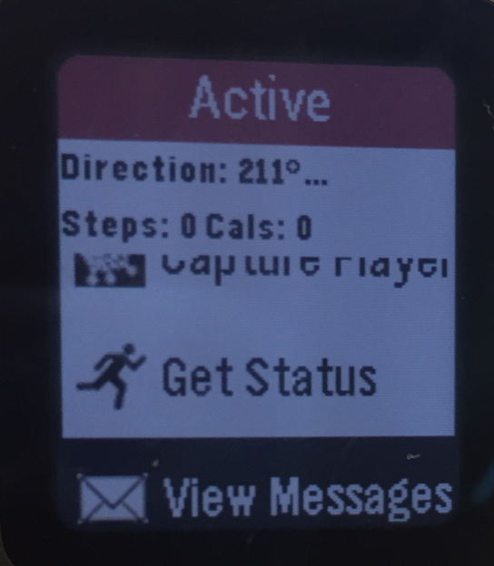
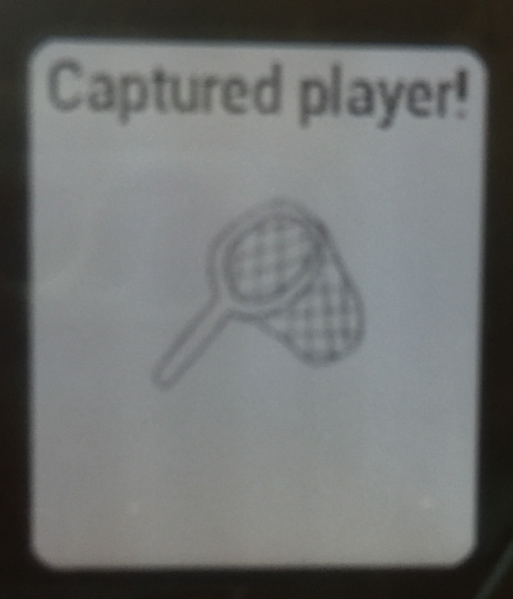
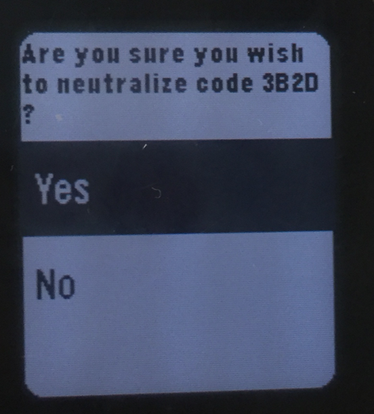

# Implementation Spec for Mission Incomputable
# Team Topaz

## Field Agent

&nbsp;

### Pseudocode

1. call main() function when app opens
2. send message to server that guide agent has entered game with game number 0, the pebbleID, the team name and player name
3. call init() function to set up UI elements
    1. create the window with window_create()
    2. set the window handlers to window_load and window_unload
    3. push the window to the top of the stack
4. call window_load() to actually load these elements
    1. create a text layer for the status
    2. create a simplemenulayer with three options
        1. neutralize code drop
        2. capture player
        3. view messages
5. call app_event_loop to wait for clicks
    1. if server sends a message to pebble
        1. parse the status and put it into the string
        2. update status
        3. put that message into the list of messages
    2. if neutralize code drop is pressed
        - call select_number() four times
            1. each time will load a simplemenulayer with choices from 0-10 and retain each choice
            2. call confirm_choice()
                - will load menu similar to first
                    1. textlayer is the code chosen
                    2. menu options are confirm or cancel
                    3. if confirm is pressed, calls the (FA_NEUTRALIZE OPCODE) with the same information as join game except for the updated gameID and the code ID (4 digit hex)
                    4. returns to original screen
    3. if capture player is pressed
        - call select_number() four times
            1. each time will load a simplemenulayer with choices from 0-10 and retain each choice
            2. call confirm_choice()
                - will load menu similar to first
                    1. textlayer is the code chosen
                    2. menu options are confirm or cancel
                    3. if confirm is pressed, calls the (FA_CAPTURE OPCODE) with the same information as above except including the captured player’s hex code and does not include location 
                    4. returns to original screen
    4. if view messages is pressed
        1. displays a text layer
        2. loads each message from the list into the text layer
    5. if 30 seconds have passed or the accelerometer data handler is triggered
        1. If the accelerometer data handler is triggered for three seconds in a row, then send FA_LOCATION message to the Game Server.
6. call window unload to destroy window elements
    1. destroy the text layer
    2. destroy the simplemenulayer
7. call deinit() to destroy app elements
    - call window_destroy on the window element

### Data Structures

– Window Struct: holds the UI elements of the Pebble face, declared in the Pebble SDK

– TextLayer Struct: a UI element that displays text

– SimpleMenuLayer Struct: a UI element that allows you to display and select an item from a menu

– List Struct: holds messages recieved by the server

### Pebble Output

We put in icons to help to user have a better sense of what each part of the app accomplishes. Especially if a user weren't as fluent in English he or she would have an easier time navigating our app with our UI. We also made the status bar red to highlight that it was an important piece of information.

### Other Extensions
We implemented the health extension and the compass extension. From the top of the home page, the compass direction is displayed. Right below, the calorie and step count since the game started is displayed.

# Guide Agent
## Pseudocode
1. execute from the commandline with usage syntax
    - `./guideAgent [-v|-log=raw] [-id=########] teamName playerName GShost GSport`
    - where -log=raw or -v is the optional verbose logging mode
    - where-id=######## is the optional guideId
    - where teamName is the Team name
    - wher playerName is the Guide Agent's chosen name
    - where GShost is the Game Server host
    - where GSport is the Game Server port number  
2. Parse flags and check for errors
3. Parse other parameters and check for errors
4. Create a log file 
5. Create the codeDrops and agents hashtables
6. Create and fill the guideAgent struct
    - Call randomHex() if necessary to create a guideId
7. Call socket_setup
    1.
8. Make the initial log to the logfile
9. While the guideId hasn't been approved
    1. Call internalUpdate to send OPCODE notifying the server that a guide has joined 
    2. Wait for the server's response
        1. If the guideId is not approved generate a new one and try again
        2. If there is some other error, exit
        3. If the guideId is approved
            - Recieve and save gameNumber
10. while game is in play
    1. using select wait for input from either the server or the guide
    2. if there is data from the server call handle_socket
        3. if OPCODE is recieved
            1. if in raw-mode
                - log the OPCODE
        2. parse OPCODE - tokenize into an array by pipes
            1. If it is a "GAME_STATUS" call updateGame()
                1. if code drops were updated call updateCodeDrops
                    1. for each code drop
                        1. verify numerical parameters
                        2. update code drop in the code drop hashtable
                        3. if code drop was neutralized
                            - log any code drop neutralization
            2. if agents were updated call updateAgents
                1. for each agent
                    1. verify numerical parameters 
                    2. update agent in the agent hashtable
                    3. if agent was captured or new agent joined
                        - log capture/join in logfile
            2. If it is a "GAME_OVER" call parseGameEnd()
                1. Parse and print game end stats to std out
                2. Exit the game
            3. If it is a "GS_RESPONSE" print to stdout

### Data Structures
- Field Agent Struct: Stores a name, status, location, and team
- Guide Agent Struct: Stores a name and status (corresponding to the guide agent running the program)
- Code Drop Struct: Stores a string name, a string status, and a double location
- Hashtables of Field Agents: Hashtable storing all field agents on all teams if level 1 and only field agents on the guide's team if level 2
- Hashtable of Code Drops: Hashtable storing all the code drops
- List of Notifications: Record of previous notifications recieved from the game server, i.e. when new agents are added, locations are updated, or statuses are updated

