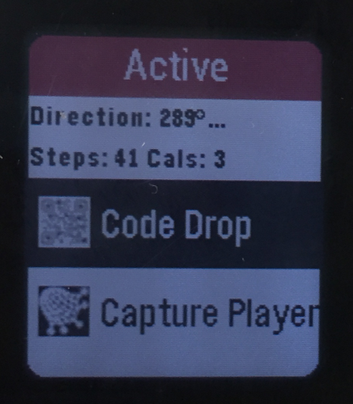
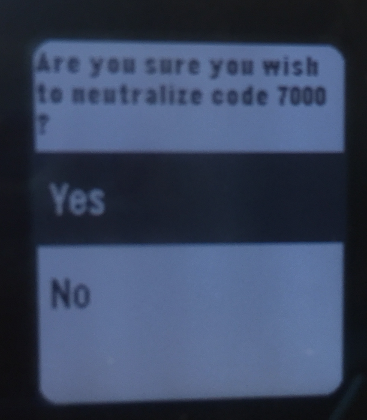
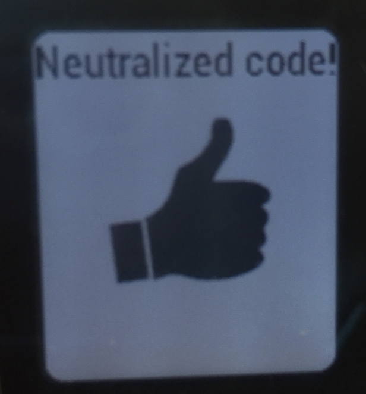
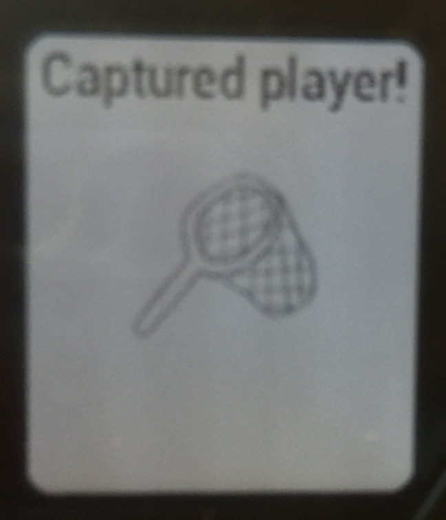
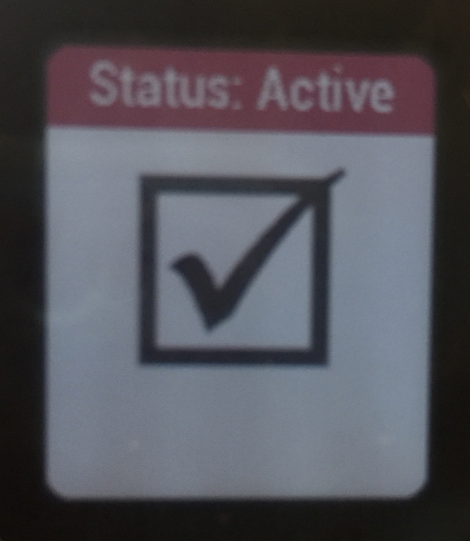
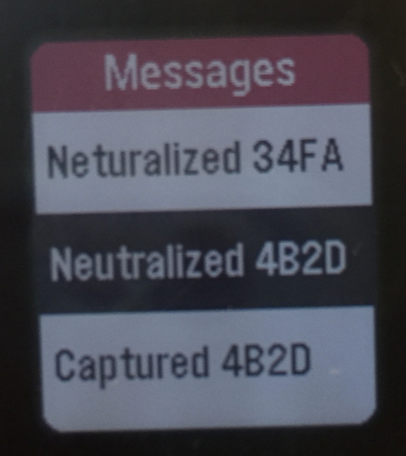
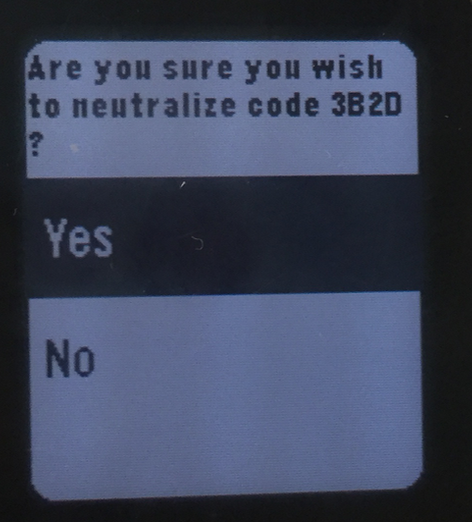

# Implementation Spec for Mission Incomputable
# Team Topaz

## Field Agent

&nbsp;

### Pseudocode

1. call main() function when app opens
2. send message to server that guide agent has entered game with game number 0, the pebbleID, the team name and player name
3. call init() function to set up UI elements
    1. create the window with window_create()
    2. set the window handlers to window_load and window_unload
    3. push the window to the top of the stack
4. call window_load() to actually load these elements
    1. create a text layer for the status
    2. create a simplemenulayer with three options
        1. neutralize code drop
        2. capture player
        3. view messages
5. call app_event_loop to wait for clicks
    1. if server sends a message to pebble
        1. parse the status and put it into the string
        2. update status
        3. put that message into the list of messages
    2. if neutralize code drop is pressed
        - call select_number() four times
            1. each time will load a simplemenulayer with choices from 0-10 and retain each choice
            2. call confirm_choice()
                - will load menu similar to first
                    1. textlayer is the code chosen
                    2. menu options are confirm or cancel
                    3. if confirm is pressed, calls the (FA_NEUTRALIZE OPCODE) with the same information as join game except for the updated gameID and the code ID (4 digit hex)
                    4. returns to original screen
    3. if capture player is pressed
        - call select_number() four times
            1. each time will load a simplemenulayer with choices from 0-10 and retain each choice
            2. call confirm_choice()
                - will load menu similar to first
                    1. textlayer is the code chosen
                    2. menu options are confirm or cancel
                    3. if confirm is pressed, calls the (FA_CAPTURE OPCODE) with the same information as above except including the captured player’s hex code and does not include location 
                    4. returns to original screen
    4. if view messages is pressed
        1. displays a text layer
        2. loads each message from the list into the text layer
    5. if 30 seconds have passed or the accelerometer data handler is triggered
        1. If the accelerometer data handler is triggered for three seconds in a row, then send FA_LOCATION message to the Game Server.
6. call window unload to destroy window elements
    1. destroy the text layer
    2. destroy the simplemenulayer
7. call deinit() to destroy app elements
    - call window_destroy on the window element

### Data Structures

– Window Struct: holds the UI elements of the Pebble face, declared in the Pebble SDK

– TextLayer Struct: a UI element that displays text

– SimpleMenuLayer Struct: a UI element that allows you to display and select an item from a menu

– List Struct: holds messages recieved by the server

### Pebble Output

# Guide Agent
## Pseudocode
1. execute from the commandline with usage syntax
    - `./guideAgent [-v|-log=raw] [-id=########] teamName playerName GShost GSport`
    - where -log=raw or -v is the optional verbose logging mode
    - where-id=######## is the optional guideId
    - where teamName is the Team name
    - wher playerName is the Guide Agent's chosen name
    - where GShost is the Game Server host
    - where GSport is the Game Server port number  
2. Parse flags and check for errors
3. Parse other parameters and check for errors
4. Create a log file 
5. Create the codeDrops and agents hashtables
6. Create and fill the guideAgent struct
    - Call randomHex() if necessary to create a guideId
7. Call socket_setup
    1.
8. Make the initial log to the logfile
9. While the guideId hasn't been approved
    1. Call internalUpdate to send OPCODE notifying the server that a guide has joined 
    2. Wait for the server's response
        1. If the guideId is not approved generate a new one and try again
        2. If there is some other error, exit
        3. If the guideId is approved
            - Recieve and save gameNumber
10. while game is in play
    1. using select wait for input from either the server or the guide
    2. if there is data from the server call handle_socket
        3. if OPCODE is recieved
            1. if in raw-mode
                - log the OPCODE
        2. parse OPCODE - tokenize into an array by pipes
            1. If it is a "GAME_STATUS" call updateGame()
                1. if code drops were updated call updateCodeDrops
                    1. for each code drop
                        1. verify numerical parameters
                        2. update code drop in the code drop hashtable
                        3. if code drop was neutralized
                            - log any code drop neutralization
            2. if agents were updated call updateAgents
                1. for each agent
                    1. verify numerical parameters 
                    2. update agent in the agent hashtable
                    3. if agent was captured or new agent joined
                        - log capture/join in logfile
            2. If it is a "GAME_OVER" call parseGameEnd()
                1. Parse and print game end stats to std out
                2. Exit the game
            3. If it is a "GS_RESPONSE" print to stdout

### Data Structures
- Field Agent Struct: Stores a name, status, location, and team
- Guide Agent Struct: Stores a name and status (corresponding to the guide agent running the program)
- Code Drop Struct: Stores a string name, a string status, and a double location
- Hashtables of Field Agents: Hashtable storing all field agents on all teams if level 1 and only field agents on the guide's team if level 2
- Hashtable of Code Drops: Hashtable storing all the code drops
- List of Notifications: Record of previous notifications recieved from the game server, i.e. when new agents are added, locations are updated, or statuses are updated

## Game Server

### Psudocode

The way we implement the `game server` is by going throw the detailed pseudo-code step by step, and verify the method, results, and any memory leaks before we move to the next step. In case, a data structure needs to be deleted, a `delete` function will be used at the end of the code to ensure accuracy in detecting any memory leaks. Also, we are planning to leverage the `list` and `counters` data structures and pre-tested functions.
The Game server code will follow roughly the following outline:

1. Execute from the command line with usage syntax
    * `./gameserver [-log=raw] [-level=2] codeDropPath GSport time`
    * where `codeDropPath` represents the path name for the code-drop file, 
    * where `GSport` is the game server port number,
    * where `time` is the duration of the game in minutes
    * `[-log=raw]` for more extensive logging option
    * `[-level=2]` to choose level 2 of the game

2. parse the command line, validate parameters, initialize other models
    - confirming that `codeDropPath` is not `NULL`
    - confirming that `codeDropPath` has the right format
    - confirming that `time` has the right format (digits only), if zero, it is considered unlimited
    - create a deaddrop code structure for each code to be neutralized (lat, long, status, neutralzing team)
    - count the number of deaddrops
    - create a list of pointers to deaddrop code structures with the specific Hex code as the key
    - confirming that `GSport` is not `NULL` and has valid digits and only digits
    - setup the socket on which to receive messages using `GSport`
        - create socket on which to listen
        - name and bind to socket using `GSport`
        - exit if setting up the socket encounters any errors
3. create a random game number between 1 and 65535 for the new game
4. create a new statistics structure that includes starting time, number of remaining code drops, and information about each team statistics
4. create a logfile `guideserver.log` in a log directory
    - update the log with start-up information (host/port where server is running, number of deaddrops, game number, game statistics information, ..etc)
5. while there are deaddrops to be neutralized or error happens or the termination flag is not set or the time is not expired
    - draw GUI using gtk
        - For each active agent in the list, draw  their location on the map
        - For each active code drop in the list,  draw its location on the map
    - By using `select`, we will listen for messages from either the server or the guide
    - receive `OPCODE` messages from guide agents and/or field agents
    - validate that the message is not an empty string
    - log the message (if the raw option chosen) into the log file
    - parse the `OPCODE` and validate it(proper `OPCODE`)
        - if it is not a proper `OPCODE`, an error code sent to any agent with a proper message (invalid OPCODE)
        - log it in the logfile
    - parse and validate the subsequent messages until the message string is `NULL` -  tokenize by pipes
        - if `gameID` is not valid (matching the above game number), an error code sent to any agent with a proper message (invalid gameID)
        - if `teamName` is not valid (matching the above game number), an error code sent to any agent with a proper message (invalid gameID)
    - process the messages according to OPCODE as stated below.
    - update the statistics structure
        - use the computer time to detect the current time and compare it to the starting time to calculate the duration of the game
        - update the remaining dead drops count by counting the number of codes that haven't been neutralized
        - scan the field agent list for statistics regarding each team (using the data fields and flags in the field agent structure)
6. Send a `gameover` message to all players including the gameID, number of remaining active code drops (if the game ends early), and each team's statistics
6. close the socket
7. delete all the `lists` and `counters` created 

&nbsp;

**Receivable OPCODE messages Pseudocode:**

* `GA_HINT`
    * Check to see if message has the correct number of arguments
    * Validate all of the given elements of the message (`gameID`, `guideID`, `teamName`, `playerName`)
    * If the `pebbleID` is valid
        * Forward the message with the same information as given to that `pebbleID`.
    * If the `pebbleID` is `*`
        * Get a reference to the message `teamName` value
        * Cycle through the list of player structs
            * If the `teamName` matches
                * Get the `pebbleID` of that pebble
                * Change the `pebbleID` of the given message with current player’s `pebble ID`.
                forward the message to the pebble
                * Update `last-contact-time` of GA
                * log it
* `GA_STATUS`
    * Check to see if message has the correct number of arguments
    * Validate all of the given elements of the message (`gameID`, `guideID`, `teamName`, `playerName`)
    * If `gameID` is 0, then register the player
        * Check to see if the player exists
            * If it does, report `MI_ERROR_INVALID_GAME_ID`
            * If it doesnt, create a new player struct and initialize a new GA player
                * Record the `remoteAddress`, `remotePort`, `playerName`, `teamName`, `agentID`, `last-contact-time` in the GA player struct.
                * add the new guide to the log file
        * Check to see if the team exists
            * if it does not, then add the team to the list of teams
        * Add the player to the list of players
    * If `gameID` is the `gameID`
        * Update last contact time of the GA player
        * If `statusReq == 1` send a `GAME_STATUS` message back to that `playerID`
* `FA_LOCATION`
    * Check to see if message has the correct number of arguments
    * Validate all of the given elements of the message (`gameID`, `guideID`, `teamName`, `playerName`)
    * If `gameID` is 0, then register the player
        * Check to see if the pebbleID is unique
        * If it is unique, create a new player struct and initialize a new FA player
            * Record the `remoteAddress`, `remotePort`, `playerName`, `teamName`, `pebbleID`, `status`, `last-contact-time`, `captureCode`, and `capturedBy`, `long`, and `lat` in the FA player struct.
            * If the teamName doesnt already exists, then add the team to the list of teams
            * Add the player to the list of players
            * * add the new field player to the log file
        * If it is and marked captured, do nothing
        * If it is not and not marked captured
            * Update the player’s current lat and long in that player’s FA player struct
            * Update `last-contact-time` in the FA player struct.
    * If `statusReq == 1`, send a `GAME_STATUS` message back to that FA.
* `FA_NEUTRALIZE`
    * Check to see if the message has the correct number of arguments.
    * Validate all of the given elements of the message (`gameID`, `guideID`, `teamName`, `playerName`)
    * For each codeDrop
        * If codeDrop is the same as givenCodeDrop,
            * If the code status is neutralized, send it is already neutralized message.
                * Confirm that the lat and long of the codeDrop and the lat long of the FA player are within 10m.
                * If they are within 10m, set the code to neutralized
                    * Send a MI_NEUTRALIZED message
                    * log it
* `FA_CAPTURE`
    * Check to see if the message has the correct number of arguments.
    * Validate all of the given elements of the message (`gameID`, `guideID`, `teamName`, `playerName`)
    * If `captureID` is 0
        * save the capturing player's lat and long
        * for each player in the player list
            * calculate the distance between players
            * if less than 10m, send that player a GS_CAPTURE_ID message
    * If `captureID` is not 0
        * cycle through the players in the player list
            * if the `captureID` is the same as the player's `captureCode`, set that player's `status` to `caputured`
            * set `capturedBy` to the `teamName` in the OPCODE.
            * send `MI_CAPTURED` message to the captured FA player
            * send `MI_CAPTURED_SUCCESS` message to the capturing FA player
            * log it 
    * Update capturing FA player's `last-contact-time`
* `GS_CAPTURE_ID`
    * Check to see if the message has the correct number of arguments.
    * Validate all of the given elements of the message (`gameID`, `guideID`, `teamName`, `playerName`)

**Send-able OPCODE messages Pseudocode for FIELD AGENT:**

* `GAME_STATUS`
    * Create a message that has the following components in the following order:
        * `gameID` is the game number.
        * `timeleft` to the end of the game
        * `guideID` is the identifier of the team's Guide Agent.
        * `NumRemainingCodeDrops` is the number of active code drops.
        * `NumFriendlyOperatives` is the number of active FAs on the same team as the requester
        * `NumFoeOperatives` which is the number of active FAs that are not on the player's team
    * log it
* `GA_HINT`
    * This message will mostly be forwarded from from the Guide Agent to the Field Agent mostly without any changes.
    * It will have the following parts:
        * `gameID` is the game number
        * `guideID` is the guide identifier
        * `teamName` is the name of the team.
        * `pebbleID` is the ID of the pebble that is being contacted (at this point there will be no '*' character)
        * `messages` is the hint message.
    * log it

**Send-able OPCODE messages Pseudocode for GUIDE AGENT:**

###### Level 1
* `GAME_STATUS|gameID|timeleft|fa1:fa2:fa3...faN|cd1:cd2:cd3:...:cdM`
    * Create a message that has the following components of the above format:
        * `gameID` is the game number.
        * `timeleft` to the end of the game
        * `fa` followed by a number represent each of the Field Agents. Field Agents are separated by colons and their information in the struct is separated by commas. The information included for each Field Agent is each section of the FA player struct.
        * `cd` followed by a number represent each of the Code Drops. Code Drops are separated by colons and their information in the struct is separated by commas. The information included for each Code Drop is the `codeID`, `lat`, `long`, and `neutralizingTeam`
   * log it
###### Level 2
* `GAME_STATUS|gameId|fa1:fa2:fa3...faN|fa1cd1:fa1cd2:...:fa1cdM|fa2cd1:fa2cd2:...:fa2cdM|...|faXcd1:faXcd2:...:faXcdM`
    * Create a message that has the following components of the above format:
        * `gameID` is the game number.
        * `fa` followed by a number represent each of the friendly Field Agents. Field Agents are separated by colons and their information in the struct is separated by commas. The information included for each Field Agent is only the `long` and the `lat` values.
        * `fa#cd` followed by a number represent each of the Code Drops. For each field agent/code drop combination, there will be a direction and a relative distance (near, close, or far). These two values will be separated by commas.
   * log it

### Data structures (e.g., struct names and members)

- Field Agent Struct: Stores `remoteAddress`, `remotePort`, `playerName`, `teamName`, `pebbleID`, `status`, `last-contact-time`, `captureCode`, and `capturedBy`, `long`, and `lat`
- Guide Agent Struct: Stores `remoteAddress`, `remotePort`, `playerName`, `teamName`, `agentID`, `last-contact-time`
- Code Drop Struct: Stores `lat`, `long`, `status`, and `neutralizing_team`
- game statistics structure: stores starting time, number of remaining code drops, and information about each team statistics
- UDP structure: from the standard library
- list of all the field players
- list of all the guide players
- list of all the teams

i.e. when new agents are added, locations are updated, and/or statuses are updated

*Security and privacy properties, Error handling and recovery*

1. Helper functions within structure codes to prevent user access to data structures
2. Defensive coding against incorrect inputs
3. `valgrind` command and memory.c

&nbsp;

*Persistent storage (log files)*

-We will only keep two kinds of log files
    - the game server log file (gameserver.log)
    - the guide agent logfile (guideagent.log)

&nbsp;
